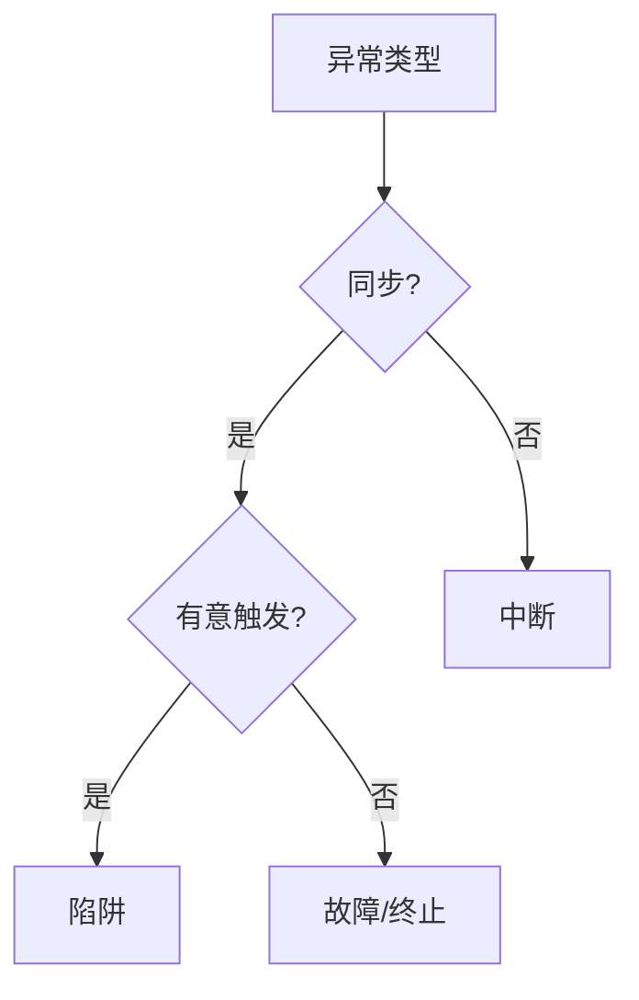

# 基于《深度理解计算机系统》第八、九章精华汇总（部分） 

> 该总结是笔者 Arles 学习《Computer Systems A Programmer's Perspective》一天Q&A · 2025.7.27

## 一、核心概念精要

### 1. 虚拟内存机制
#### ▎问题本质
- **矛盾**：有限物理内存 vs 无限地址空间需求
- **解法**：虚拟地址转换 + 按需加载

#### ▎三级类比体系
| 抽象层       | 现实类比                | 技术实现                  |
|--------------|-------------------------|--------------------------|
| 虚拟地址空间 | 独立邮编号码体系        | 每个进程拥有完整地址范围   |
| MMU转换      | 邮局分拣机              | 页表查询 + TLB缓存        |
| 缺页处理     | 临时调货流程            | 磁盘→内存加载 + 页表更新   |

#### ▎验证方法
```bash
# 查看进程内存映射
sudo grep '00400000' /proc/{PID1,PID2}/maps

# 统计缺页异常
perf stat -e major-faults,minor-faults ./a.out
```

### 2. 存储层次结构
#### ▎性能矩阵
| 层级        | 访问时间 | 硬件实现 | 管理方     |
|-------------|----------|----------|------------|
| 寄存器      | 0.3ns    | SRAM     | 编译器      |
| L1缓存      | 1ns      | SRAM     | 硬件        |
| 主存(DRAM)  | 100ns    | DRAM     | OS         |
| 磁盘        | 1ms      | NAND     | 文件系统    |

#### ▎关键差异
```diff
! SRAM vs DRAM
- SRAM: 6晶体管/bit, 无需刷新 (适合Cache)
- DRAM: 1晶体管+1电容/bit, 需刷新 (适合主存)
```

### 3. 异常控制流
#### ▎分类决策树


#### ▎特征对比表
| 类型  | 触发源   | 返回行为      | 案例                |
|-------|----------|---------------|---------------------|
| 陷阱  | 程序主动 | 总是返回下条   | 系统调用            |
| 故障  | 意外错误 | 可能返回当前   | 缺页异常            |
| 终止  | 硬件错误 | 永不返回       | DRAM ECC错误        |
| 中断  | 外部设备 | 返回中断点     | 定时器中断          |

## 二、实践验证记录

### 1. 进程上下文实验
```c
// context_test.c
#include <stdio.h>
#include <unistd.h>

int main() {
    printf("PID:%d 虚拟地址:%p\n", getpid(), &main);
    sleep(60);  // 观察相同虚拟地址在不同进程的表现
    return 0;
}
```

#### ▎观测结果
```bash
# 终端1输出
PID:1234 虚拟地址:0x400520

# 终端2输出
PID:5678 虚拟地址:0x400520 
```

### 2. 悬空指针检测
```bash
# 编译检测
gcc -fsanitize=address -g dangling_ptr.c

# 典型输出
==ERROR: AddressSanitizer: heap-use-after-free
```

## 三、认知升级路线

1. **虚拟化思维**  
   - 所有进程都活在OS编织的"地址梦"中
   - 通过`CR3`寄存器实现平行宇宙切换

2. **异常处理哲学**  
   - 故障是OS的急救系统（可恢复）
   - 终止是系统的安乐死（不可逆）

3. **性能本质**  
   - 存储体系 = 用复杂度换速度差
   - 上下文切换 = 状态保存的艺术

## 问题拓展

1. **虚拟内存的页表切换与缓存一致性**  
   当进程切换导致CR3寄存器更新时，CPU如何保证TLB和缓存中过时的虚拟地址映射不会引发错误？硬件和操作系统分别承担了哪些职责？

2. **异常处理中的递归陷阱**  
   如果缺页异常处理程序自身触发缺页（例如其代码页未被加载），操作系统如何避免这种无限递归？现代CPU是否提供特殊机制应对？

3. **上下文切换的性能极限**  
   在每秒数百万次上下文切换的云原生场景下，传统保存/恢复全部寄存器的方式是否依然最优？ARM的ContextID寄存器等新设计如何优化这一过程？


